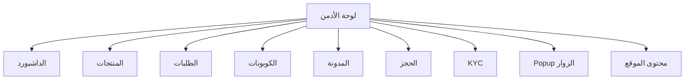
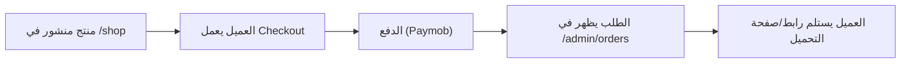
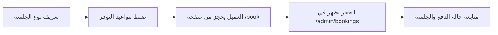
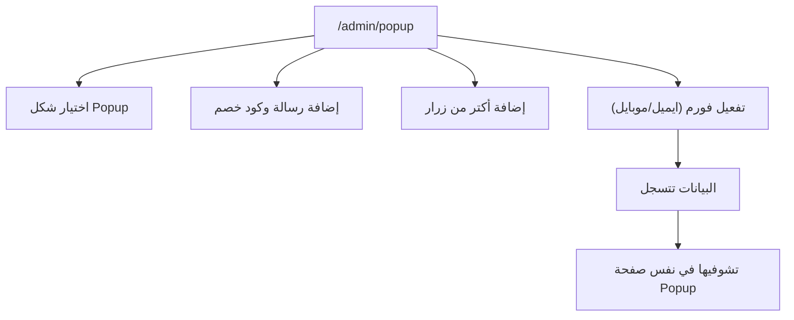

# Radwa Admin Guide (Non-Technical)

هذا الملف يشرح لوحة التحكم بطريقة بسيطة، بدون مصطلحات تقنية.
الهدف: أي حد من فريق البزنس يقدر يفهم "أعمل إيه منين؟" في أقل وقت.

## 1) لوحة الأدمن في دقيقة

لوحة الأدمن هي المكان اللي بتتحكمّي منه في:

- المنتجات وأسعارها وملفاتها.
- الطلبات والدفع والكوبونات.
- المدونة والمحتوى العام للموقع.
- نظام الحجز (أنواع الجلسات + المواعيد + الحجوزات).
- طلبات التقسيط (KYC).
- الـ Popup اللي بيظهر للزوار.

## 2) خريطة الصفحات: كل صفحة بتعمل إيه؟

| الصفحة | بتعملي منها إيه؟ | تستخدميها إمتى؟ |
|---|---|---|
| `/admin` | نظرة سريعة على الإيراد، الطلبات، آخر رسائل التواصل، ملخص الحجز | بداية اليوم |
| `/admin/products` | إدارة المنتجات (إضافة/تعديل/حذف + نشر/مسودة + منتج مميز + تفعيل تقسيط) | عند إضافة أو تحديث منتج |
| `/admin/orders` | متابعة الطلبات وحالة الدفع وبيانات العميل | لمتابعة المبيعات |
| `/admin/coupons` | إنشاء/تعديل/تفعيل/تعطيل/حذف كوبونات (فردي وجماعي) | قبل الحملات والعروض |
| `/admin/blog` | إدارة المقالات (كتابة Rich Text + نشر/مسودة + حذف) | خطة المحتوى |
| `/admin/kyc` | مراجعة مستندات التقسيط وقبول/رفض مع سبب الرفض | طلبات التقسيط |
| `/admin/event-types` | إنشاء أنواع الجلسات (مدة/سعر/وصف/إعدادات الدعوة) | تجهيز خدمات الاستشارة |
| `/admin/availability` | تحديد مواعيدك الأسبوعية + استثناءات أيام معينة | ضبط جدول الحجز |
| `/admin/bookings` | عرض الحجوزات القادمة والسابقة + حالة الدفع + رابط الاجتماع | تشغيل يومي للحجوزات |
| `/admin/booking-profile` | الاسم والصورة ورسالة الترحيب الظاهرة في صفحة الحجز | تحسين شكل صفحة الحجز |
| `/admin/popup` | إنشاء Popup احترافي، كود خصم، أزرار متعددة، فورم بيانات الزوار، ومعاينة مباشرة | حملات الترويج |
| `/admin/content` | تعديل بيانات الموقع، الشهادات، timeline، والصفحات القانونية | تحديث المحتوى العام |

## 3) أهم المهام اليومية (Quick Playbook)

### A) إضافة منتج جديد

1. افتحي `المنتجات` ثم `منتج جديد`.
2. اكتبي العنوان والسعر والوصف.
3. أضيفي صورة المنتج (برابط أو رفع مباشر).
4. أضيفي ملف المنتج:
   - رفع مباشر من نفس الصفحة.
   - أو رابط مباشر (Cloudflare/R2).
5. اختاري حالة المنتج `منشور` لو جاهز للبيع.

### B) تشغيل عرض بكوبون

1. افتحي `الكوبونات`.
2. اعملي كوبون جديد (نوع الخصم + القيمة + المدة + عدد الاستخدامات).
3. فعّليه.
4. روّجي للكود في الـ Popup أو السوشيال.

### C) مراجعة طلبات التقسيط

1. افتحي `طلبات KYC`.
2. راجعي المستندات.
3. لو كاملة: `قبول`.
4. لو ناقصة: `رفض` مع سبب واضح.

### D) تشغيل الحجز

1. من `أنواع الجلسات`: حددي نوع الجلسة وسعرها ومدتها.
2. من `مواعيد التوفر`: اضبطي جدولك الأسبوعي.
3. من `الحجوزات`: تابعي المواعيد القادمة.

## 4) رسمة رحلة البيع (من المنتج للدفع للتسليم)

## 5) رسمة رحلة الحجز (استشارة)

## 6) رسمة Popup التسويقي

## 7) ماذا يمكن فعله داخل Popup الآن؟

- 3 أشكال جاهزة للـ Popup.
- إبراز كود خصم بشكل واضح.
- زر نسخ للكود.
- حتى 4 أزرار، وكل زر له وظيفة مستقلة:
  - فتح رابط
  - نسخ كود
  - إغلاق
- Live Preview أثناء التعديل.
- فورم تجميع بيانات (اسم/إيميل/موبايل).
- جدول داخل الأدمن يعرض العملاء اللي سجلوا بياناتهم.

## 8) إدارة المحتوى العام للموقع

من صفحة `محتوى الموقع` تقدري تعدلي:

- بيانات التواصل الأساسية (إيميل، موبايل، واتساب، اسم البراند).
- نصوص CTA الرئيسية.
- قسم "رحلتي المهنية" في الصفحة الرئيسية.
- Timeline صفحة About.
- آراء العملاء/الشركاء.
- الصفحات القانونية:
  - الشروط
  - الخصوصية
  - الاسترجاع

## 9) Bulk Actions (توفير وقت)

في بعض الصفحات تقدري تعملي تحديد جماعي:

- المنتجات:
  - نشر / تحويل لمسودة / أرشفة / حذف جماعي.
- المقالات:
  - نشر / تحويل لمسودة / حذف جماعي.
- الكوبونات:
  - تفعيل / تعطيل / حذف جماعي.

## 10) ملاحظات تشغيل مهمة

- أي تعديل في `status` للمنتج يؤثر مباشرة على ظهوره في المتجر.
- قبل أي حملة إعلانية:
  - تأكدي إن المنتج `منشور`.
  - الكوبون `مفعّل`.
  - صفحة الدفع شغالة.
- قبل فتح مواعيد استشارات:
  - تأكدي من السعر في نوع الجلسة.
  - تأكدي إن التوفر الأسبوعي مضبوط.

## 11) Checklist أسبوعي سريع

1. مراجعة الطلبات الجديدة في `/admin/orders`.
2. مراجعة طلبات KYC والرد عليها.
3. تحديث كوبونات الحملات المنتهية.
4. تحديث المنتجات/المقالات الجديدة.
5. مراجعة حجوزات الأسبوع القادم.
6. تحديث Popup إن في عرض جديد.

## 12) لو حصل خطأ

- غالبًا المشكلة بتكون من:
  - حقل ناقص (زي سعر أو عنوان).
  - رابط غير صحيح.
  - صلاحية كوبون منتهية.
- أول خطوة: أعيدي المحاولة بعد تحديث الصفحة.
- لو استمرت المشكلة: ابعتي صورة للخطأ + الصفحة اللي كنتي فيها + الخطوة اللي عملتيها.

---

### نسخة سريعة جدًا (ملخص التنفيذ)

لو هتشرحي لحد بسرعة:

- "المنتجات" = إدارة اللي بيتباع.
- "الطلبات" = متابعة الفلوس والعملاء.
- "الكوبونات" = الخصومات.
- "المدونة" = المحتوى.
- "الحجز" = الاستشارات والمواعيد.
- "KYC" = مراجعة التقسيط.
- "Popup" = عروض سريعة + جمع بيانات العملاء.
- "محتوى الموقع" = التحكم في النصوص والصفحات الأساسية.
